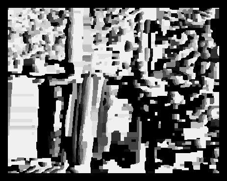

# LoopyBeliefPropagation
Disparity Map Calculation Using Belief Propagation
## Motivation
The field of stereo vision is still a fundamental challenge in computer vision and image processing that finds corresponding points between two stereo images. This repo contains my own implementation of the loopy belief propagation algorithm in python which was inspired and derived from this blog [post](https://nghiaho.com/?page_id=1366). Unfortunately, this implementation was incredibly slow. However, I found a repository with another implementation of the loopy belief propagation using max product algorithm which was much faster. These results were compared to the middlebury ground truth disparity maps and compared to a deep learning algorithm proposed by Jia Ren Chang and Yong-Sheng Chen. [GitHub](https://github.com/JiaRenChang/PSMNet/tree/master) with PSMNet, a pyramid stereo matching network. The level of comparision involves using a structural simliarity index (SSIM). The data set used comes from [Middlebury](https://vision.middlebury.edu/stereo/data/scenes2005/)
## First Algorithm
The first algorithm was developed from this blog [post](https://nghiaho.com/?page_id=1366). An MRF was built to formulate the stereo problem into a graphical model involving probabilities. The energy function $$energy(Y,X) = \sum_i DataCost(y_i,x_i) + \sum_{j=neighbours of i}SmoothnessCost(x_i,x_j)$$
was used to calculate the energy of all costs that link an image given and some labeling. The aim is to find a labeling that produces the lowest cost in energy. The data cost returns the penalty of assinging a label. This function calculates the data cost for a pixel given the left and right images, its coordinates, and a label. It computes the absolute differences between corresponding pixel instesities in a local window around the pixel. The smoothness cost computes the absolute difference and scales it by some constant lambda. If the difference exceeds a threshold, it truncates the cost to the threshold. The message is then sent by computing the minimum cost among all possible label combinations and stores it in the message bp algorithm is then applied, which iterates over all pixels in the MRF and calls send message to send messages to their neghboring pixels. The max product is the algorithm used for the message updating. It keeps track of the largest marginal probability. The results are then saved to an output png file. As you can see, it is blurry and quite innacurate.
### Sample Image of Books Using Loopy Belief Propagation

## Belief Propagation Second Algorithm
There was open source [software](https://github.com/aperezlebel/StereoMatching/tree/master) for this exact problem which wound up being must faster than I had originally started off with. This implementation was used as an alternative comparison for faster and more accurate results. I was able to make a few adjustments to make it run quite a bit faster. In the update_msg function, I was able to replace a for loop with numpy broadcasting and shaved off a good 8-9 seconds during runtime. I also used scikit skopt Optimizer to find an optimal number of disparity values, a lambda scalar value, and a number of iterations. This allowed for more accurate results when comparing against the deep learning algorithm and the ground truth disparity maps.
### Sample Image of Books Using the Second Implementation of Belief Propagation

### Comparisons of Belief Propagation With Ground Truth

## Deep Learning Stereo Vision
Deep learning algorithm for stereo vision was used as a comparison. It did perform much faster than anticipated and was incredibly accurate. Again, it was compared to the previous algorithms via SSIM. [GitHub](https://github.com/JiaRenChang/PSMNet/tree/master)

##Results
The equation used to draw comparisons between the deep learning algorithm and the open source belief propagation software were quite close. On average, the RMSE score for belief propagation was 10.4568. The deep learning algorithm was averaged at 10.2238. However, the average time of the belief propagation algorithm was at around 9 seconds, while the deep learning was either 2 seconds or slightly under. This makes up for a drastic difference in time, but quite similar with this testing approach. In the future, I would find it helpful to test for other metrics such as occlusion which I didn't have time for. I would also like to use a larger data set and work more on my own implementation of the belief propagation algorithm. 
